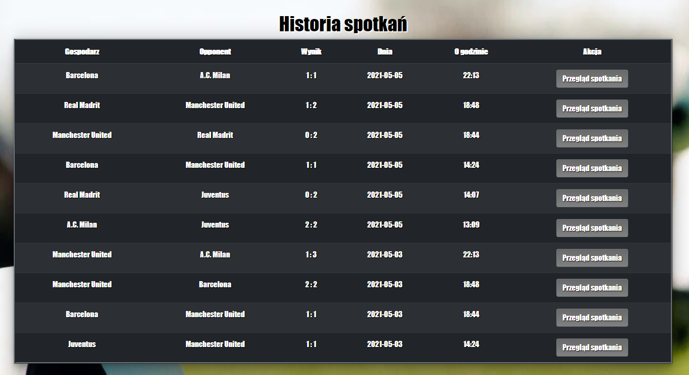

# Project Name

Football Maker is a place, where can you check your best football teams, watch how they play and bet matches.

## General info

App let us to create account and try to win money by betting on soccer matches. They are randomly generated, and the
players' skill determines the result of the match and the amount of winnings. The application allows us to view each
team as well as each player, a summary of the number of goals scored, and the history of the games. The user has his own
profile in which he can view his previous wins or losses. He can also edit his login details and profile picture. The
football teams data is completely artificial. I'm not a football fan :)

## Screenshots

## Technologies

SpringBoot version 2.4.4 
Spring - Security, Validation, Web, JPA, 
SpringBoot Thymeleaf, Thymeleaf Layout Dialect
Bootstrap 
Lombok 
JavaScript
HTML5
CSS3

## Setup

In the case of testing, the application does not require configuration because it is embedded in the built-in database,
but, when the application is turned off, the data will be lost.

To run the application correctly, first run the "FootBall", and then "Maker" and go to
the [This address](http://localhost:8080/])

## Features
List of features ready and TODOs for future development

* Create Unit tests
* improve the system so that matches do not run at the same time
* Improve the goal scoring system

## Status

Project is finished but needs a few improvements

## Inspiration

I was inspired by my brother who loves football and from time to time tries his luck in football betting

## Contact

Created by [Machikur](https://github.com/Machikur) - feel free to contact me!